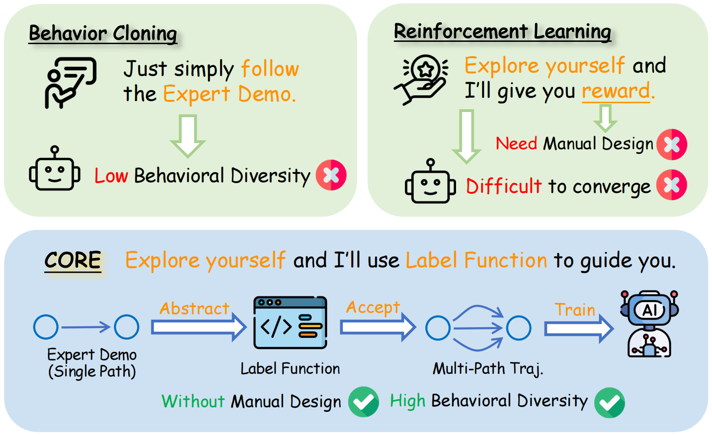
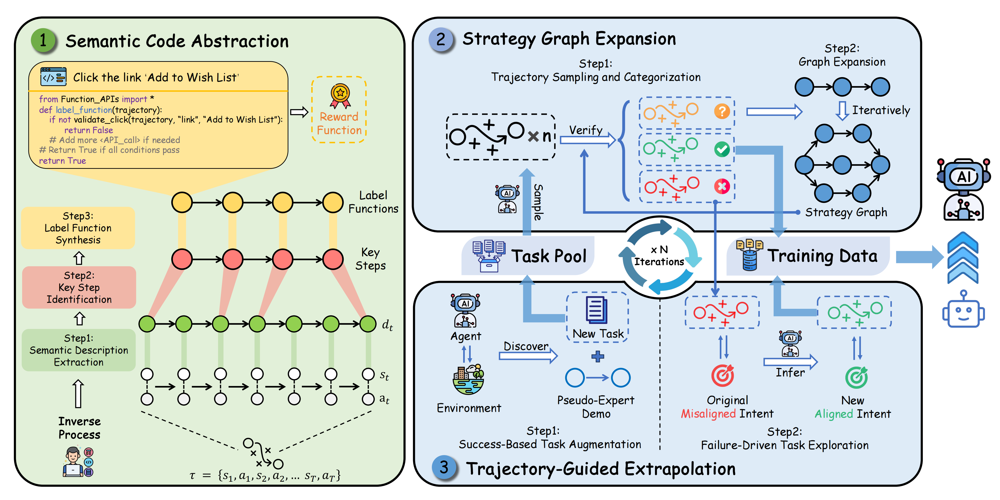

<h1 align="center" style="line-height: 40px;">
  CORE: Code-based Inverse Self-Training Framework with Graph Expansion for Virtual Agents
</h1>

## Introduction

Welcome to the official repository for the paper "CORE: **Co**de-based Inve**r**se S**e**lf-Training Framework with Graph Expansion for Virtual Agents"

## Overview

