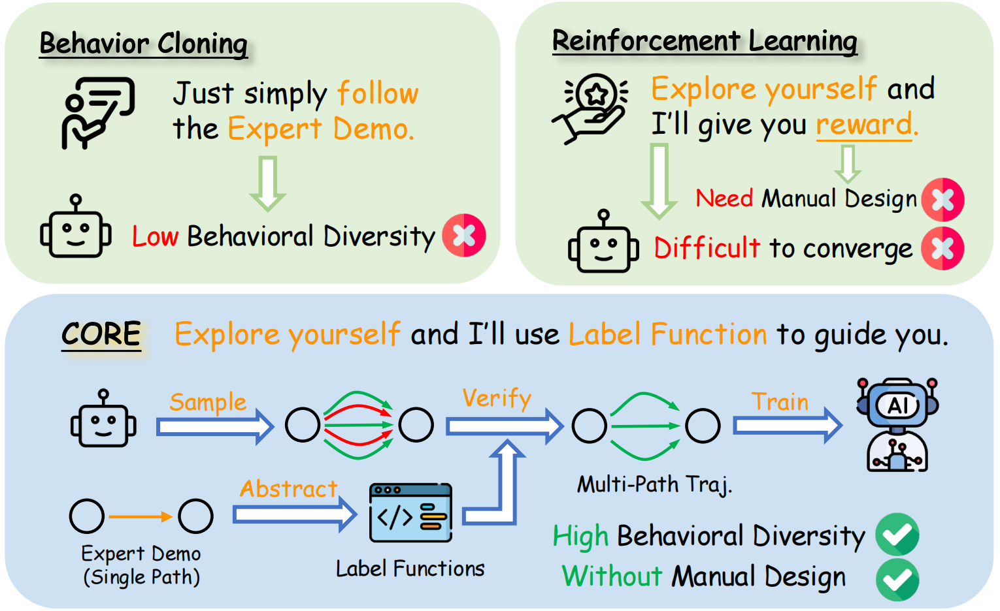

<h1 align="center" style="line-height: 40px;">
  CORE: Code-based Inverse Self-Training Framework with Graph Expansion for Virtual Agents
</h1>

Anonymous submission

# 🌍 Introduction

The development of Multimodal Virtual Agents has advanced with Multimodal Large Language Models (MLLMs), but training remains challenging. Behavior Cloning enables imitation but limits behavioral diversity, while Reinforcement Learning encourages exploration yet depends on manually crafted rewards. To overcome this, we propose **CORE**, a **Co**de-based Inve**r**se S**e**lf-Training Framework with Graph Expansion. CORE eliminates manual reward design and boosts diversity through three innovations: **Semantic Code Abstraction**, which auto-generates executable Label Functions from expert demos; **Strategy Graph Expansion**, which builds a multi-path graph capturing diverse valid strategies; and **Trajectory-Guided Extrapolation**, which uses both successful and failed trajectories to broaden task space. Experiments on Web and Android show that CORE improves performance and generalization, offering a robust framework for training Virtual Agents.

# 🔥 News

-  [2025.07.29] We have released the source code for our overall pipeline.  
-  [2025.07.26] We have created the official repo for CORE.

# 💡 Overview

**CORE**: A Code-based Inverse Self-Training Framework that derives executable reward functions from expert demonstrations via **Semantic Code Abstraction**, enhances in-domain diversity through multi-path **Strategy Graph Expansion**, and enriches out-of-domain diversity by recycling trajectories with **Trajectory-Guided Extrapolation**, forming a iterative self-improving pipeline for training robust and generalizable Multimodal Virtual Agents.

  # 🎖️ Run Examples

Here is an example demonstrating how **Strategy Graph Expansion** grows the graph and enriches behavioral diversity:

Here is an example demonstrating how Label Functions validate key steps and mitigate the risk of misjudgments inherent in result-based benchmarks that evaluate only the final state:

